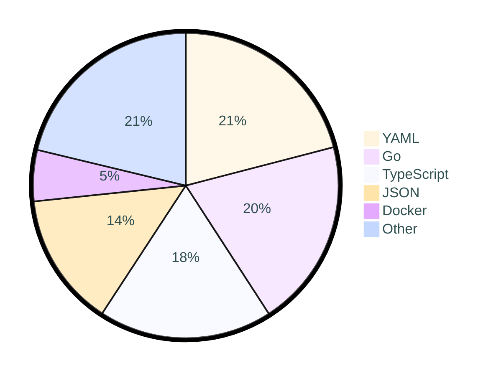

<div align="center">

[](https://github.com/tot0p/Hello-World)

</div>

# [Hi 👋, I'm tot0p](https://tot0p.github.io/tot0p/) :

[Ecla](https://github.com/Eclalang) , V1.0.0 is [here](https://github.com/Eclalang/Ecla) !!!!!!!!!


## Connect with me :
[](https://linkedin.com/in/thomas-lemaitre78)
<!--
[](https://dev.to/tot0p)
[](https://medium.com/@tot0p)
-->

## 💻Tech Stack
                   


## 📊GitHub Stats :


### 🔥 Streak stats

<div align="center">


</div>

<details align="center"> 
  <summary><h3>⭐ More Github Stats </h3></summary>
  


</details>

<!--WAKATIME-->
## Work Time of last 7 days

```text
🌐 Time zone: Europe/Paris

🗓️ From 2025-04-09T22:00:00Z to 2025-04-16T21:59:59Z

⌚ Total time: 7 hrs 36 mins

💬 Languages:

YAML           1 hr 35 mins >>>------- 20.95 %
Go             1 hr 30 mins >>-------- 19.91 %
TypeScript     1 hr 23 mins >>-------- 18.36 %
JSON           1 hr 4 mins  >>-------- 14.13 %
Docker         24 mins      >--------- 5.42 %
HTML           17 mins      >--------- 3.73 %
Bash           14 mins      >--------- 3.16 %
JavaScript     14 mins      >--------- 3.08 %
SCSS           13 mins      >--------- 2.89 %
Shell Script   12 mins      >--------- 2.71 %
Other          7 mins       >--------- 1.58 %
Git Config     5 mins       >--------- 1.1 %
Markdown       4 mins       >--------- 0.99 %
GitIgnore file 4 mins       >--------- 0.89 %
TSConfig       3 mins       >--------- 0.79 %
go.mod         0 secs       >--------- 0.09 %
CSS            0 secs       >--------- 0.09 %
Text           0 secs       >--------- 0.06 %
Mustache       0 secs       >--------- 0.04 %
CMake          0 secs       >--------- 0.02 %
C++            0 secs       >--------- 0.02 %

🔥 IDE:

VS Code 4 hrs 55 mins >>>>>>>--- 64.73 %
GoLand  2 hrs 40 mins >>>>------ 35.27 %

💻 OS:

Windows 7 hrs 36 mins >>>>>>>>>> 100.0 %
```
### Pie chart of Time repartition

<!--/WAKATIME-->


## Top 3 Projects By Stars

<div align="center">

<!--Top-Repositories-->
| Top | Repo                                                                                                                                                                                    |
|-----|-----------------------------------------------------------------------------------------------------------------------------------------------------------------------------------------|
| 1   | <a href="https://github.com/Eclalang/Ecla"></a>           |
| 2   | <a href="https://github.com/tot0p/Hello-World"></a>   |
| 3   | <a href="https://github.com/Eclalang/LearnEcla"></a> |

<!--/Top-Repositories-->

  
</div>

## Duck of the readme 🦆

<div align="center">

<!--DUCK-->
### Duck changed by [Saviru](https://github.com/Saviru)
[](https://github.com/tot0p/tot0p/issues/new?title=%F0%9F%A6%86%20Quack)
<!--/DUCK-->

[Change the duck](https://github.com/tot0p/tot0p/issues/new?title=%F0%9F%A6%86%20Quack)

Submit the issue to change the duck

> :warning: The duck will be changed only if the title is `🦆 Quack` :warning:


</div>
