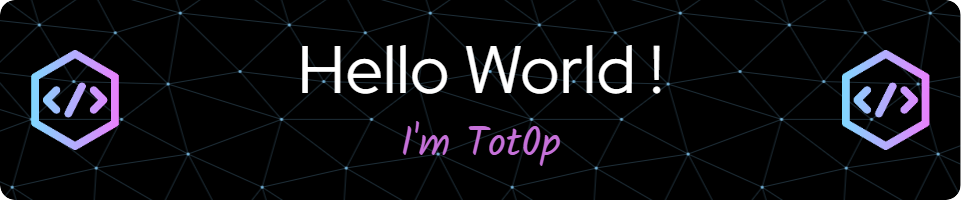
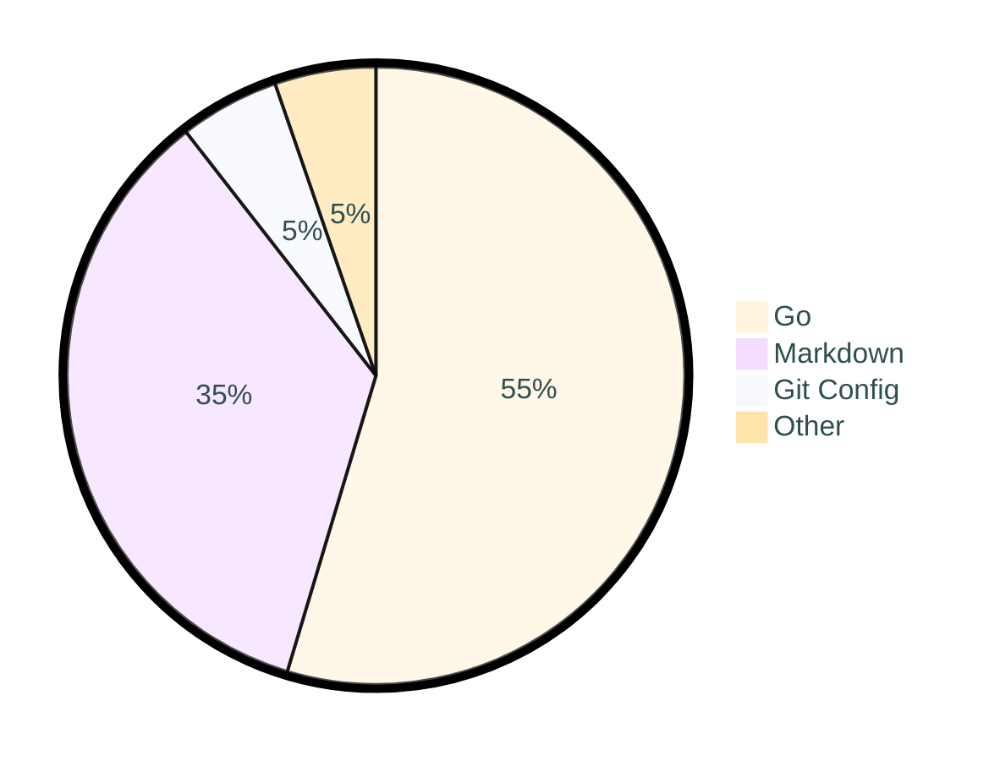

<div align="center">

# ✨ Welcome to tot0p's GitHub ✨

[](https://github.com/tot0p/Hello-World)

[](https://github.com/tot0p)
[](https://github.com/tot0p)

</div>

## 👨‍💻 About Me

> **[Hi 👋, I'm tot0p](https://tot0p.github.io/tot0p/)** - Developer, creator, and tech enthusiast

I'm excited to announce that [Ecla](https://github.com/Eclalang) v1.0.0 is now available! [Check it out here](https://github.com/Eclalang/Ecla) 🚀

## 🔗 Connect with me

<div align="center">
  
[](https://linkedin.com/in/thomas-lemaitre78)
<!--
[](https://dev.to/tot0p)
[](https://medium.com/@tot0p)
-->

</div>

## 💻 Tech Stack

<div align="center">

### Languages


### Web Technologies


### Databases


### Servers & Platforms


</div>


## 📊 GitHub Stats

<div align="center">
  


</div>

### 🔥 Streak Stats

<div align="center">
  

  
</div>

<details align="center"> 
  <summary><h3>⭐ More GitHub Stats </h3></summary>
  <div align="center">
    
    
  </div>
</details>

<!--WAKATIME-->
## Work Time of last 7 days

```text
🌐 Time zone: Europe/Paris

🗓️ From 2025-05-23T22:00:00Z to 2025-05-30T21:59:59Z

⌚ Total time: 5 hrs 3 mins

💬 Languages:

Go         2 hrs 45 mins >>>>>>---- 54.63 %
Markdown   1 hr 45 mins  >>>>------ 34.84 %
Git Config 15 mins       >--------- 5.24 %
YAML       8 mins        >--------- 2.78 %
C++        5 mins        >--------- 1.79 %
Other      1 min         >--------- 0.53 %
SQL        0 secs        >--------- 0.18 %
Binary     0 secs        >--------- 0.01 %
C#         0 secs        ---------- 0.0 %

🔥 IDE:

VS Code       5 hrs 2 mins >>>>>>>>>> 99.76 %
Visual Studio 0 secs       >--------- 0.24 %

💻 OS:

Windows 4 hrs 6 mins >>>>>>>>>- 81.3 %
Linux   56 mins      >>-------- 18.7 %
```
### Pie chart of Time repartition

<!--/WAKATIME-->


## 🏆 Top 3 Projects By Stars

<div align="center">

<!--Top-Repositories-->
| Top | Repo                                                                                                                                                                                    |
|-----|-----------------------------------------------------------------------------------------------------------------------------------------------------------------------------------------|
| 1   | <a href="https://github.com/Eclalang/Ecla"></a>           |
| 2   | <a href="https://github.com/tot0p/Hello-World"></a>   |
| 3   | <a href="https://github.com/Eclalang/LearnEcla"></a> |

<!--/Top-Repositories-->

  
</div>


## 🦆 Duck of the README

<div align="center">

<!--DUCK-->
### Duck changed by [mkarten](https://github.com/mkarten)
[](https://github.com/tot0p/tot0p/issues/new?title=%F0%9F%A6%86%20Quack)
<!--/DUCK-->

<div style="background-color: #f0f0f0; border-radius: 8px; padding: 10px; margin: 10px; display: inline-block;">
  <a href="https://github.com/tot0p/tot0p/issues/new?title=%F0%9F%A6%86%20Quack">🦆 Change the duck 🦆</a>
</div>

<p align="center">
  <i>Click the link above to submit an issue to change the duck.</i><br>
  <b>⚠️ The duck will only be changed if the issue title is <code>🦆 Quack</code> ⚠️</b>
</p>


</div>

<div align="center">
  
### Made with ❤️ by tot0p
  
</div>
