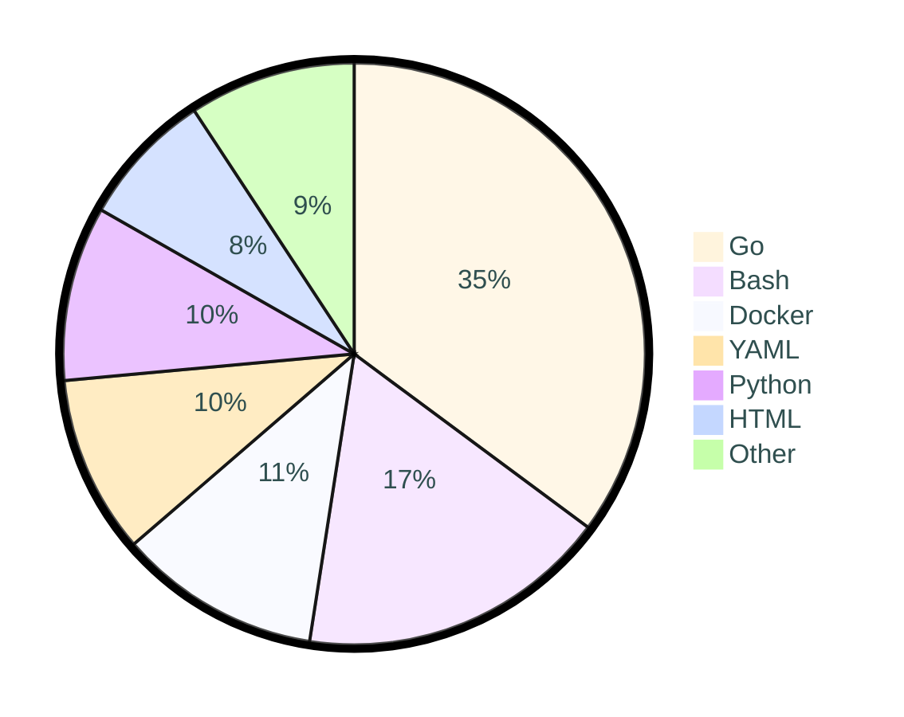

<div align="center">

[](https://github.com/tot0p/Hello-World)

</div>

# [Hi 👋, I'm tot0p](https://tot0p.github.io/tot0p/) :
I'm in my third year at ynov paris

[Ecla](https://github.com/Eclalang) , V1.0.0 is [here](https://github.com/Eclalang/Ecla) !!!!!!!!!


## Connect with me :
[](https://linkedin.com/in/thomas-lemaitre78)
<!--
[](https://dev.to/tot0p)
[](https://medium.com/@tot0p)
-->

## 💻Tech Stack
                   


## 📊GitHub Stats :


### 🔥 Streak stats

<div align="center">


</div>

<details align="center"> 
  <summary><h3>⭐ More Github Stats </h3></summary>
  


</details>

## Work Time of last 7 days

<!--WAKATIME-->
```text
🌐 Time zone: Europe/Paris

🗓️ From 2024-05-23T22:00:00Z to 2024-05-30T21:59:59Z

⌚ Total time: 5 hrs 5 mins

💬 Languages:

Go             1 hr 47 mins >>>>------ 35.16 %
Bash           52 mins      >>-------- 17.29 %
Docker         34 mins      >>-------- 11.21 %
YAML           30 mins      >--------- 9.88 %
Python         29 mins      >--------- 9.7 %
HTML           22 mins      >--------- 7.51 %
Markdown       10 mins      >--------- 3.58 %
Ruby           10 mins      >--------- 3.45 %
GitIgnore file 2 mins       >--------- 0.81 %
go.mod         1 min        >--------- 0.46 %
Git Config     1 min        >--------- 0.35 %
Text           1 min        >--------- 0.33 %
Rust           0 secs       >--------- 0.15 %
TOML           0 secs       >--------- 0.11 %
Ecla           0 secs       >--------- 0.01 %

🔥 IDE:

GoLand  2 hrs 44 mins >>>>>>---- 53.78 %
VS Code 2 hrs 21 mins >>>>>----- 46.22 %

💻 OS:

Windows 5 hrs 5 mins >>>>>>>>>> 100.0 %
```
### Pie chart of Time repartition

<!--/WAKATIME-->


## Top 3 Projects By Stars

<div align="center">

<!--TABLE-->
| Top | Repo                                                                                                                                                                                    |
|-----|-----------------------------------------------------------------------------------------------------------------------------------------------------------------------------------------|
| 1   | <a href="https://github.com/Eclalang/Ecla"></a>           |
| 2   | <a href="https://github.com/Eclalang/LearnEcla"></a> |
| 3   | <a href="https://github.com/tot0p/Hello-World"></a>   |

<!--/TABLE-->

  
</div>

## Duck of the readme 🦆

<div align="center">

<!--DUCK-->
### Duck changed by [Esenel19](https://github.com/Esenel19)
[](https://github.com/tot0p/tot0p/issues/new?title=%F0%9F%A6%86%20Quack)
<!--/DUCK-->

[Change the duck](https://github.com/tot0p/tot0p/issues/new?title=%F0%9F%A6%86%20Quack)

Submit the issue to change the duck

> :warning: The duck will be changed only if the title is `🦆 Quack` :warning:


</div>